

  

  

## Table of Contents

1. 

     
<a href="#about">About</a>

   <a href="https://david5p.github.io/geography-quiz/">The Countries and Capitals Quiz</a> project is a website for Geography lovers looking to test their knowledge.
   The website is targeted towards adults and teenager looking for a geography quiz. It could also be used in educational settings for anyone aged 10 and older.

   Users of the website will be able to answer questions and receive feedback on their answers immediately. There is a timer for each question adding a challenge to answer in 20 seconds. If the user does not answer the question in the alloted time, the quiz will automatically give feedback to the user and then move on.

   

2. 

     
User Experience

     <ul>
       <li>
         

           
Goals

           <ul>
             <li><a href="#visitor-goals">Visitor Goals</a></li>
             <li><a href="#business-goals">Business Goals</a></li>
             <li><a href="#user-stories">User Stories</a></li>
           </ul>
         

       </li>
       <li>
         

           
Visual Design

           <ul>
             <li><a href="#wireframes-and-project-board">Wireframes and Project Board</a></li>
             <li><a href="#fonts">Fonts</a></li>
             <li><a href="#icon">Icon</a></li>
             <li><a href="#colors">Colors</a></li>
             <li><a href="#images">Images</a></li>
             <li><a href="#styling">Styling</a></li>
           </ul>
         

       </li>
     </ul>
   

3. 

     
Features

     <ul>
       <li>
         

           
Page Elements

           <ul>
             <li><a href="#all-pages">All Pages</a></li>
             <li><a href="#index-page">Index Page</a></li>
             <li><a href="#gallery-page">Gallery Page</a></li>
             <li><a href="#schedule-page">Schedule Page</a></li>
           </ul>
         

       </li>
       <li>
         

           
Additional Features

           <ul>
             <li><a href="#success-page">Success Page</a></li>
             <li><a href="#error-page">Error Page</a></li>
           </ul>
         

       </li>
       <li>
         

           
Technologies Used

           <ul>
             <li><a href="#languages">Languages</a></li>
             <li><a href="#frameworks">Frameworks</a></li>
             <li><a href="#libraries">Libraries</a></li>
             <li><a href="#platforms">Platforms</a></li>
             <li><a href="#other-tools">Other Tools</a></li>
           </ul>
         

       </li>
     </ul>
   

4. 

     
Testing

     <ul>
       <li>
         

           
Methods

           <ul>
             <li><a href="#validation">Validation</a></li>
             <li><a href="#general-testing">General Testing</a></li>
             <li><a href="#pagespeed-insights">Pagespeed Insights</a></li>
           </ul>
         

       </li>
       <li>
         

           
Bugs

           <ul>
             <li><a href="#known-and-fixed-bugs">Known and Fixed Bugs</a></li>
           </ul>
         

       </li>
     </ul>
   

5. 

     
Deployment

     <ul>
       <li><a href="#deployment">Deployment Details</a></li>
     </ul>
   

6. 

     
Credit

     <ul>
       <li><a href="#content-and-images">Content and Images</a></li>
     </ul>
   

---

# User Experience (UX)

## Goals

### Visitor Goals

The target audience for The Capitals and Country Quiz are:

- Teenagers and adults who are quiz and trivia enthusiasts.
- Upper Primary to Secondary school students looking to test their knowledge.
- Educators looking for material.
- Travel enthusiasts.

User goals are:

- Receive feedback on their performance in the quiz.
- To enjoy doing the quiz.
- Improve trivia knowledge.
- Learn or reinforce knowledge.

The Capitals and Countries quiz fulfills these needs by:

- Users receive feedback after each question.
- Users see a scoreboard of how many questions they have got right or wrong.
- Variance of questions covering the whole world.
- Bank of questions where only a selection are used in each quiz.
- User can follow the time set for each question or choose to move at a faster pace

### Business Goals

The Business Goals of The Capitals and Countries Quiz are:

- Increase user engagement and retention.
- The well-structured quiz will drive traffic to the website.
- Support, test and reinforce educational objectives

### User Stories

1. When using the website for the first time, I need a simple navigation system with user friendly design. It needs to work well on mobile, tablet and desktop without issues.

2. As a user, I want to come to the site and be able to answer questions and trust if my answer is right or wrong.

3. As a visitor, I want to see enticing and exciting images of the capital cities or a map pointer.

4. As a user, I want to test my geographical knowledge in different areas.

5. As a user, I want to complete the quiz in the available time.

6. As a user, I want to challenge myself and have different levels of complexity.

7. As a user, I want to know how well I am doing in the quiz.

8. As a user, I want to know how well I have done at the end of the quiz

## Visual Design

### Wireframes and Project Board

Wireframes: https://drive.google.com/file/d/1VVts8mL-VwiWUL6Y6gXo_xzze9kkFflV/view?usp=sharing

- I used the projects board to help me plan my website. I have found it a useful check guide since it was introduced and have decided to continue using it on my projects.
- The plan allowed me to focus on achieving what was most important to include in my website first before attempting to achieve other features.
- It is also a useful tool to see how I could develop my website in the future or without time constraints.

### Fonts

- The primary font, <a href="https://fonts.google.com/specimen/Outfit">Outfit</a> was chosen because it provides clear and legible text. It is a font that provides a modern appearance and works effectively on all the buttons for the quiz. This sans-serif font
  combines smoothly with my color schemes across the website. It provides a good contrast from the font chosen for my title.

  

- The secondary font, <a href="https://fonts.google.com/specimen/Josefin+Sans">Josefin Sans</a> was chosen to give the heading elegance and flair.It is a classic font which provides a retro feel which means it compliments the modern font choice of Outfit. The font works well with large text and functions well as a heading for this creative project of the quiz.

### Favicon

- The favicon is linked from the <a href="https://fontawesome.com/">Fontawesome</a>Icon library.
- My Favicon was then generated by <a href="https://favicon.io/">favicon.io</a> and the globe is fitting for the capitals and countries focus of the website.

### Colors

  

- I picked the colors (image above is a screenshot taken from <a href="https://coolors.co/">Coolors</a>) of the website from the hero image using an <a href="https://imagecolorpicker.com/">image color picker</a> tool to help me with my choices.

  

- I varied some of the shades recommended by the image color picker so my website had sufficient contrast.
- Colors were tested to ensure WCAG AA-level contrast compliance using WebAIM's checker.

  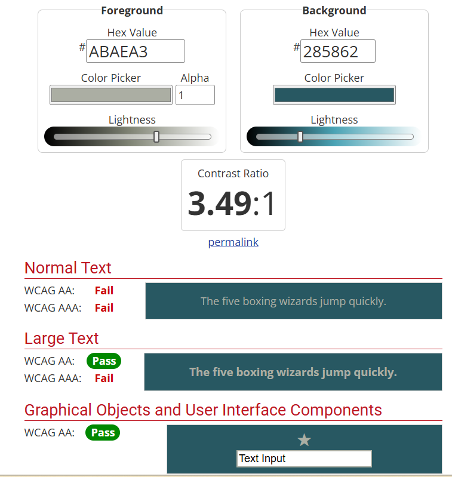

- The midnight green was quite a dark background choice and the color picker from image resulted in lighter shade recommendation. However, It was neither a dark nor light background and it proved problematic to match other colors with it whilst maintaining a good contrast level.
- This resulted in my other color choices needing to be sufficiently bright to give a good contrast level.

  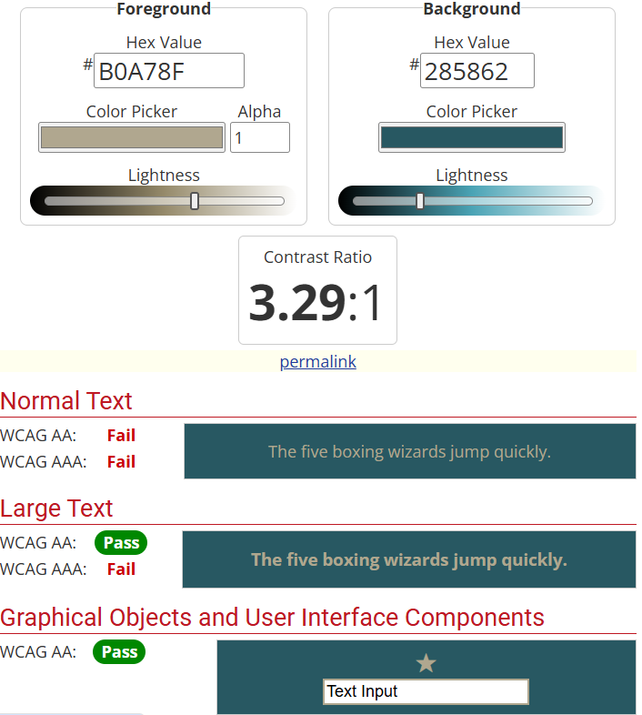

- The midnight green background provides a great backdrop for the lighter colors of ash grey and khaki.
- Text for the question and answer options are black and bold against their lighter background choices.
- When the user answers the question, the question and answer options seemlessly change background color depending on the user's answer and the text color changes to white to reflect the changed darker backgrounds.
- White was chosen for the main-headings as it stands out against the midnight green background color

### Images

- The main image on the homepage was chosen as it is an ideal choice for both countries and capitals.

### Styling

- I used Bootstrap 5.3 classes where possible to support with positioning, text style and size.
- I have applied my preferred colors and fonts using custom css.
- I have added in JavaScript classes using hide or display none in different places so that the user always remains on the same page.
- The answer buttons are also added dynamically through JavaScript and then styled using classes in CSS.

# Features

## Page Elements

#### Main Menu

- When the user comes to the site it is fully responsive using bootstrap classes.
- The menu is easy to understand and the user has 2 options to choose from.

#### Game Play

- Once the user starts the game, the page is clearly laid out with the question, answer buttons, timer and scoreboard all well positioned.

  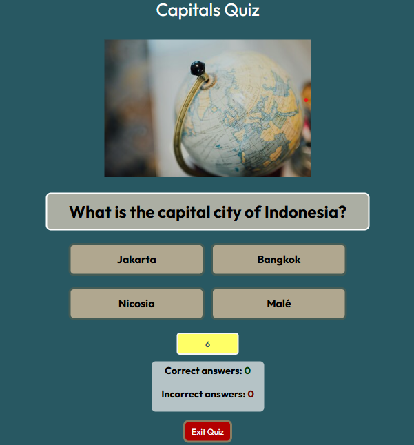

- The layout for the quiz on medium (≥768px) and larger screens sees the answers in a 2-by-2 grid layout. This works well on iPads, laptops and desktops and takes away any need for the user to scroll.

  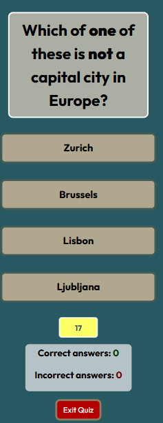

- On smaller devices, the answers stack on top of each other allowing the quiz to function smoothly too.

  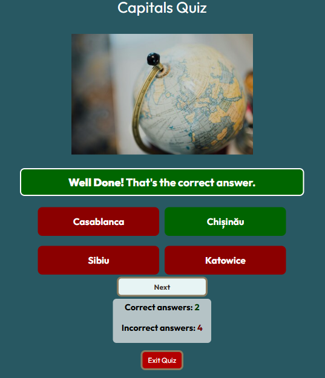

- Use of CSS classes and JavaScript allows the colors of the screen to change depending on if the user is correct or incorrect. Above is an example of a correct answer where the answer they chose is green and all the other options turn red. The question container changes color to green and provides feedback to the user.

  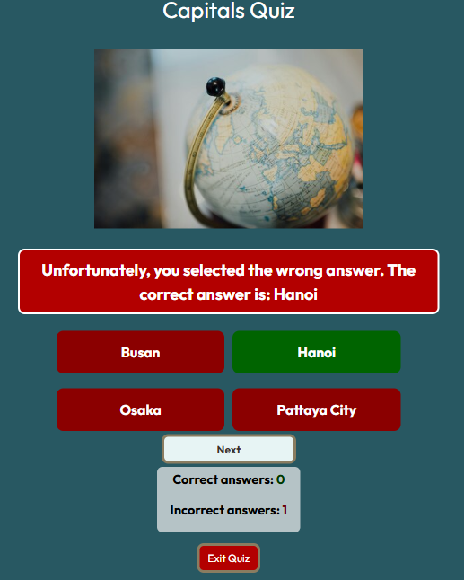

- The page acts in a similar way when the user gives an incorrect answer but instead of the question container going green, it changes color to red.

- The bottom of the screen includes the score area, timer, next button and exit quiz. The compact layout chosen ensures users can see all game elements without scrolling, fulfilling my design goal. One solution I explored was moving the score area next to the answer buttons on medium screens or larger with flexbox, but that caused layout issues with the score area floating on the screen. So, I chose the relative position at the bottom of the screen.

#### End of quiz

  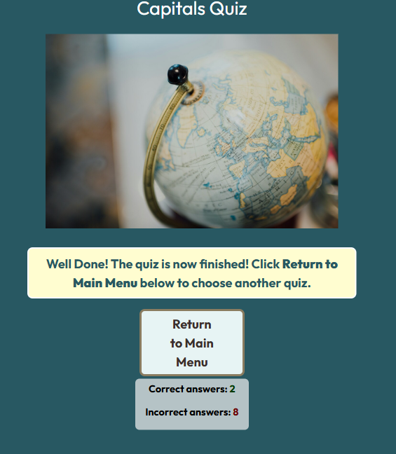

- 3 Seconds after the user finishes the quiz, the answer buttons will disapear and then the question container's style will change with a message informing the user the quiz has finished.
- When the user finishes the quiz, I want the user to return to the main menu. The new button's appearance replace the next button will take the user back to the screen they see when they enter the site.

- The user can also see the finished scoreboard of how many they got correct and incorrect before exiting the quiz.

# Technologies Used

## Languages

- **HTML**  
  Page markup.
- **CSS**  
  Styling.
- **JavaScript**  
  Behavior.

## Frameworks

- [Bootstrap 5](https://getbootstrap.com/)  
  Used for basic styles and layout templates.

## Libraries

- [Google Fonts](https://fonts.google.com)  
  Font styles.
- [Font Awesome](https://fontawesome.com/)  
  Used for favicon.

## Platforms

- [GitHub](https://github.com/)  
  Storing code remotely and deployment.
- [Visual Studio Code](https://code.visualstudio.com/)  
  IDE for project development.

## Other Tools

- [Canva](https://canva.com/)  
  Used to create wireframes.
- [Image Color Picker](https://imagecolorpicker.com/)  
  Choosing color palette.
- [WebAIM Contrast Checker](https://webaim.org/resources/contrastchecker/)  
  Affirming accessible color choices.

  # Testing

## Methods

### Validation

| App          | Screenshot                                                                                                                                        |
| ------------ | ------------------------------------------------------------------------------------------------------------------------------------------------- |
| `index.html` | 

No errors report
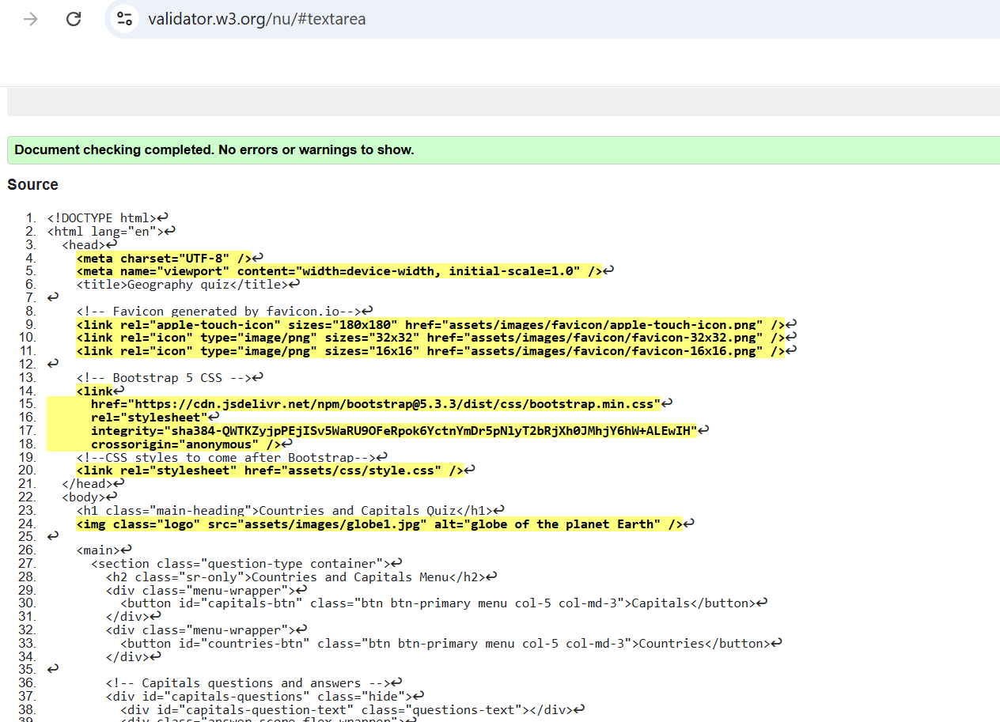
 |
| `style.css`  | 

No errors report
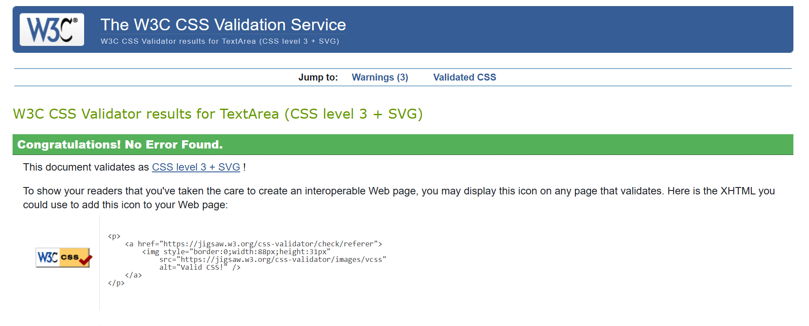
        |
| `script.js`  | 

No errors report
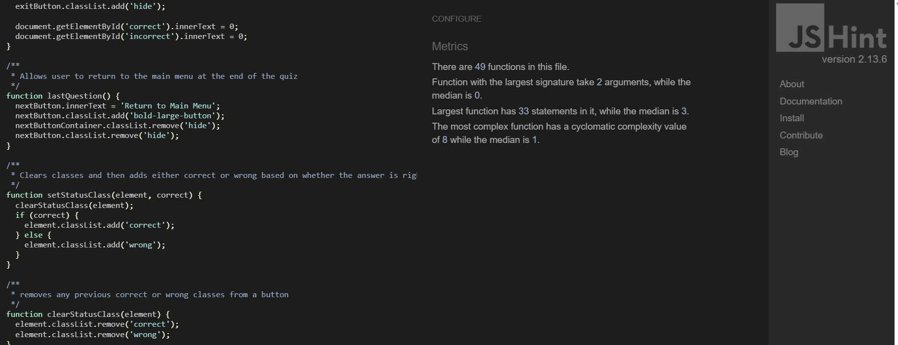
           |

- As the table above shows the HTML has been validated with [W3C HTML5 Validator](https://validator.w3.org/), the CSS has been validated with [W3C CSS Validator](https://jigsaw.w3.org/css-validator/) and the JavaScript has been validated with [JS Hint](https://jshint.com/) .
- The CSS valididator did flag four warnings with one referencing Google Fonts and two others accounted for by each of the CSS variables. I did have one other warning which I will detail below.

  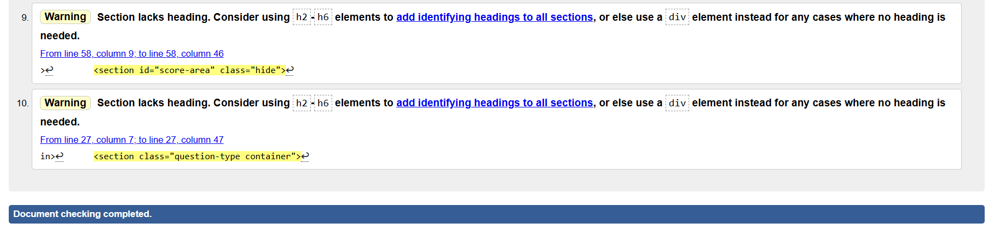
  

- With regards to my HTML code I had two errors of the same type to fix before zero were shown. My question container and score area both had the same warning about not containing any h1-6 elements in them. Their absence presented problems because the semantic structure used made it unclear what the section is about. Aside from headings provide hierarchical meaning, I recognised the need to include them to help browsers, assistive technologies, and search engines understand content organization.
- In my Question container and score area, I have no need for a heading and feel the buttons are clear what the user needs to do. Adding a header will be a distraction.
- I found solution to my issue <a href="https://v1.tailwindcss.com/docs/screen-readers">online</a> by using the h2 element in both my sections but essentially keeping visually hidden. This hides the content without removing it from the accessibility tree. However, the inclusion of the h2 element improves accessibility, usability, and document outline clarity which are crucial for effective communication and user experience.

  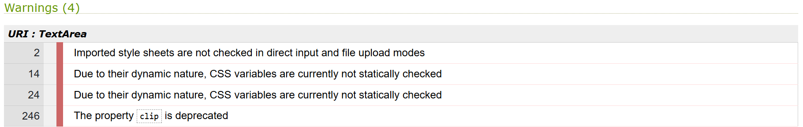

- This solution initially caused a CSS warning as the property used the clip property which is depreciated and needed changing to the clip-path property.

  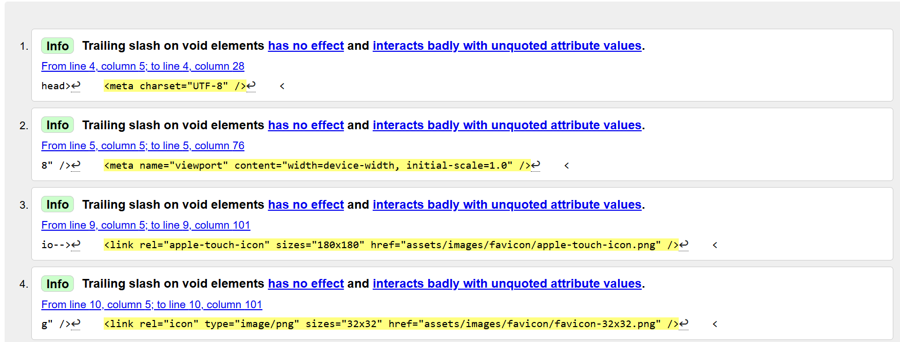

-I received 8 info alerts from the HTML validator relating to trailing slashes. This is due to the add on prettier formatting my HTML and they cannot be removed. The trailing slash on void elements doesn’t affect rendering or cause any errors in my code.

### General Testing

- The website was tested across Google Chrome, Safari, Mozilla Firefox and the mobile test was done using Google Dev tools on an Asus Zenfone 9 and no issues were found.

- Each time new features and behaviors were added the preview and the deployed site were checked for functionality.

- The website was tested by friends on both mobile and desktop devices.

- The user stories provided a noteworthy reference point and I was allowed to ensure and test that all of the must haves were achieved for the website.

- The website's functionality was primarily checked and assessed on Google Chrome and using Dev Tools to check fuctionality on different screen sizes.

- I recognise that if I were to develop this project, It would be wise to refactor some of my JavaScript code. A number of my functions contain similar code as I have separate capitals and countries functions. By refactoring some functions in my JavaScript and then calling capitals and countries as the arguements. Then if I wanted to add more categories I would just add more arguements to the function call rather than creating new functions for each category

#### User Stories Reflection

- During the testing process and I looked back at my user stories to see if I achieved all of my Must-haves.

- My quiz website has a friendly design and works well on all devices.

- There is a clear color scheme and style when the user answers the questions so they know if they have answered correctly or incorrectly.Both quizzes has been tested on different device and the color scheme and styles were applying correctly.

- The question bank for the two categories features questions from countries across the world so meets the user criteria of testing a range of geographical knowledge.

- The timer for each question provides a challenge for the user to complete the 10 question quiz in a maximum of 200 seconds (20 seconds per question). The timer works well and resets after each question.

- The inclusion of the score area allows the user to track their progress throughout the quiz with both the incorrect and correct answer tallies functioning without a fault.

- If I were to develop the project, I would include different levels and imagery for each question as stated in my user stories on my project board.

### PageSpeed Insights

- I tested the website on PageSpeed Insights which allowed me to find out more details of issues. My accessibility was not 100% due to the resolution of the image and my best practices was also not 100% due to a missing meta tag in my HTML. As you can see in the tables below PageSpeed Insights desktop and PageSpeed Insights mobile have given the website 100% for accessibility.

| App        | Screenshot desktop and mobile                                                                                                                            |
| ---------- | -------------------------------------------------------------------------------------------------------------------------------------------------------- |
| index.html | 

100% Accessibility
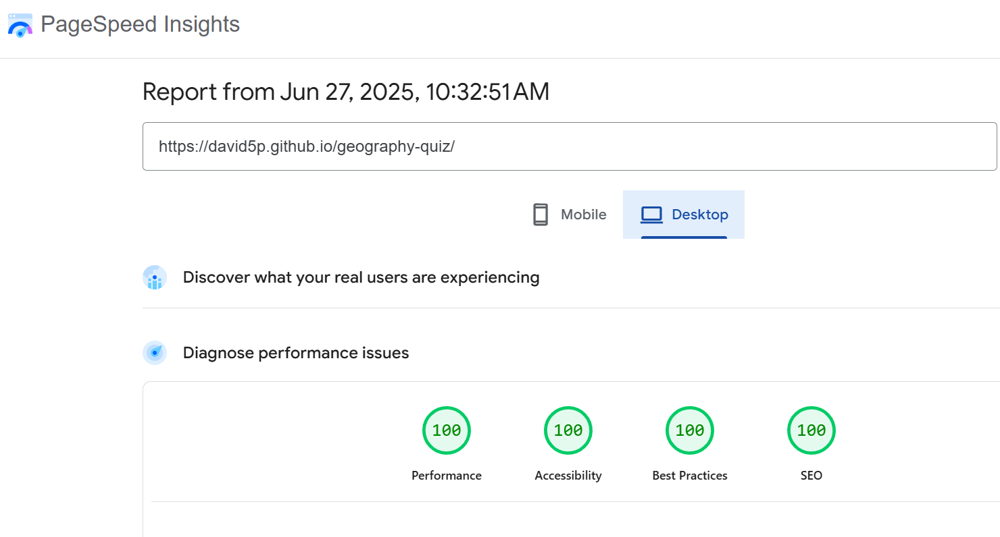
 |
| index.html | 

100% Accessibility
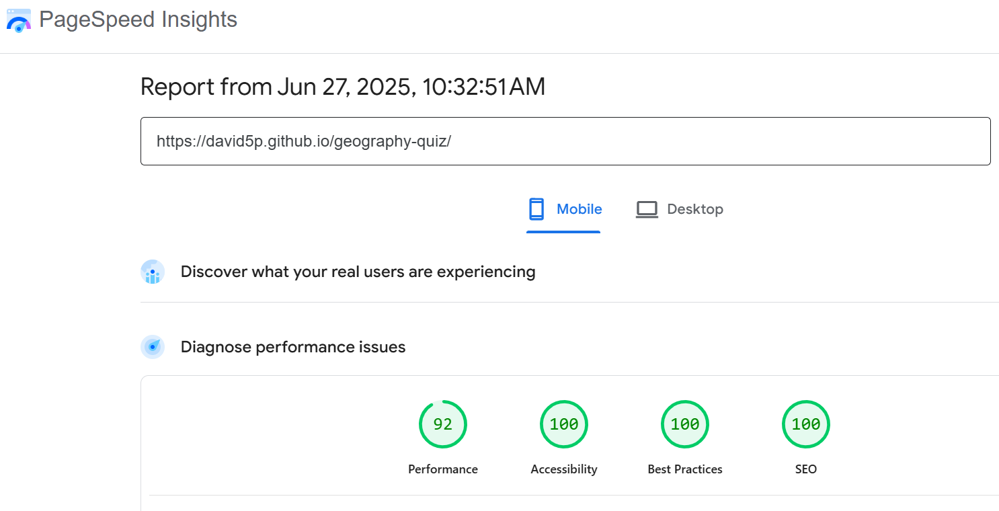
   |

## Bugs

### Known and fixed Bugs

- I had an issue with my exit button prompting an alert twice. I resolved this issue by ensuring the event listener was only added once and not being adding twice because of the two game types.

- I noticed a small glitch where the Bootstrap styles show on my two buttons before my custom styles take effect. I attempted to fix this by increasing specifity in my CSS and moved my CSS link in my index.html after my Bootstrap one but this did not solve the issue. This issue remains outstanding.

  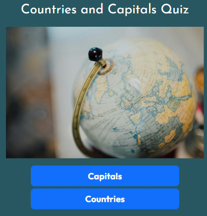
  

- I tested the website by playing the different quizzes multiple times and could not find any more bugs or glitches. I tried clicking multiple times on different answer buttons but the screen locks upon the first selection and does not allow another click. I tried this on different devices and used inspect to test responsiveness.

- The next button only appears once on each question and I can not find a bug with it. Similarly, my timer always counts down from 20 seconds on each question and always reset upon testing. Initially, I had the timer remaining on the screen after each question but as mentioned previously, the bottom area of the page was congested with the next button and score area so it works better that the timer hides as soon as the user answers the question.

### Deployment

The steps below detail how I deployed my live site:

- The site was deployed to GitHub Pages. The steps taken were as follows:

  - In the GitHub repository, navigate to the **Settings** tab on the top menu.
  - From the settings page, navigate to the **Pages** section on the left-hand side menu.
  - From the drop-down menu, select **"Deploy From a Branch"**.
  - Press the **Save** button.
  - After a few minutes, you can refresh the page to see your Live Site link at the top.

- To **Fork** the repository:

  - On GitHub.com, navigate to the repository.
  - In the top-right corner of the page, click **Fork**.
  - Choose an owner for the forked repository.
  - Forks are named the same as their parent repositories. You can change the name of the fork.
  - Add a description of your fork if you wish.
  - Choose whether to copy the default branch or every branch to the new fork.
  - Click **Create fork**.

- To **Clone** the repository:
  - On GitHub.com, navigate to the repository.
  - Above the list of files, click the **Code** dropdown button which will bring up a list of options.
  - Where the URL appears in the dropdown, **copy the URL**.
  - Open **Git Bash**.
  - Change the current working directory to the location where you want to keep the cloned directory.
  - Type `git clone` followed by pasting the URL you copied earlier.
  - Press **Enter**, and your local clone will be created.

The live link to the website can be found here: [Capitals and Countries Quiz](https://david5p.github.io/geography-quiz/)

## Credit

### Content and Images

- The hero image was used from <a href="https://unsplash.com/"> Unsplash.</a>
- I referred to the Love Maths project for creating my initial HTML structure and what functions I would require.
- I also created my score area using the Love Maths project as as basis for it.
- I found the following walkthrough <a href="https://www.youtube.com/watch?v=riDzcEQbX6k">video</a> on making a quiz useful in helping me form the basis for my quiz before adding my own custom features. The quiz helped me set up a number of function which helped form the structure of my quiz.
- I used StackOverflow a few times including when I was attempting to solve the <a href="https://stackoverflow.com/questions/77343449/using-of-trailing-slash-in-void-element">trailing slash issue</a> and to help me <a href="https://stackoverflow.com/questions/68994961/how-can-i-make-a-certain-word-bold-in-javascript">bold certain words</a> in my questions.
