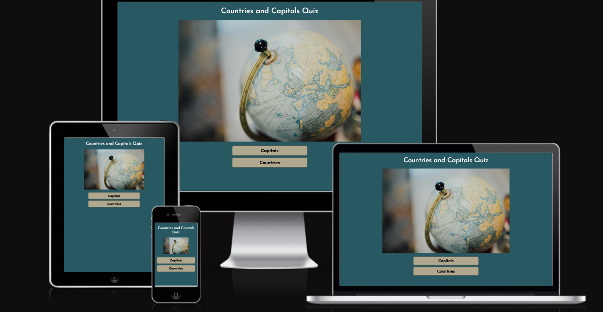
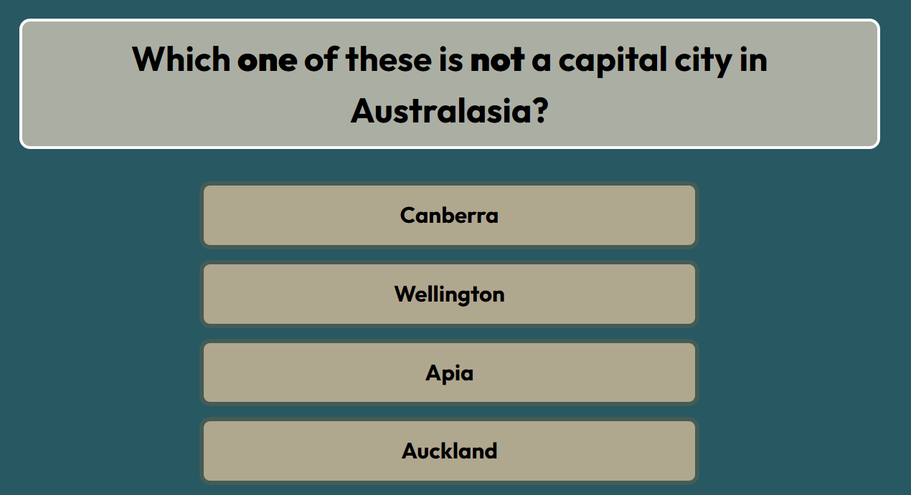
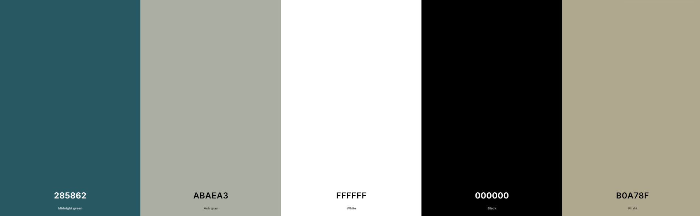
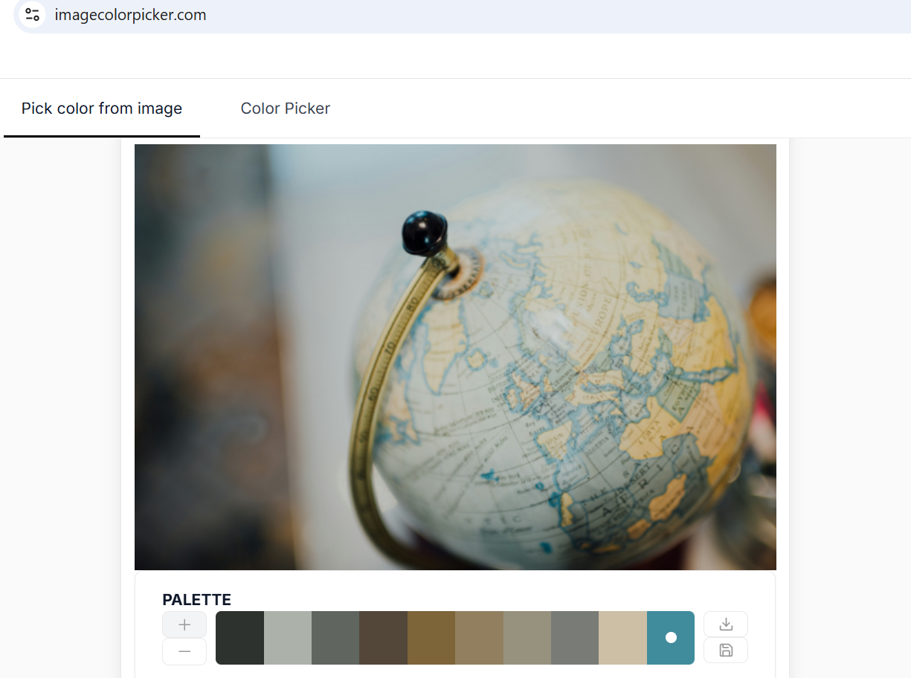

  

  

## Table of Contents

1.  

    
<a href="#about">About</a>

    <a href="https://david5p.github.io/geography-quiz/">The Countries and Capitals Quiz</a> project is a website for Geography lovers looking to test their knowledge.
    The website is targeted towards adults and teenager looking for a geography quiz. It could also be used in educational settings for anyone aged 10 and older.

    Users of the website will be able to answer questions and receive feedback on their answers immediately. There is a timer for each question adding a challenge to answer in 20 seconds. If the user does not answer the question in the alloted time, the quiz will automatically give feedback to the user and then move on.

2.  

      
User Experience

      <ul>
        <li>
          

            
Goals

            <ul>
              <li><a href="#visitor-goals">Visitor Goals</a></li>
              <li><a href="#business-goals">Business Goals</a></li>
              <li><a href="#user-stories">User Stories</a></li>
            </ul>
          

        </li>
        <li>
          

            
Visual Design

            <ul>
              <li><a href="#wireframes-and-project-board">Wireframes and Project Board</a></li>
              <li><a href="#fonts">Fonts</a></li>
              <li><a href="#icon">Icon</a></li>
              <li><a href="#colors">Colors</a></li>
              <li><a href="#images">Images</a></li>
              <li><a href="#styling">Styling</a></li>
            </ul>
          

        </li>
      </ul>
    

  
Features

  <ul>
    <li>
      

        
Page Elements

        <ul>
          <li><a href="#all-pages">All Pages</a></li>
          <li><a href="#index-page">Index Page</a></li>
          <li><a href="#gallery-page">Gallery Page</a></li>
          <li><a href="#schedule-page">Schedule Page</a></li>
        </ul>
      

    </li>
    <li>
      

        
Additional Features

        <ul>
          <li><a href="#success-page">Success Page</a></li>
          <li><a href="#error-page">Error Page</a></li>
        </ul>
      

    </li>
    <li>
      

        
Technologies Used

        <ul>
          <li><a href="#languages">Languages</a></li>
          <li><a href="#frameworks">Frameworks</a></li>
          <li><a href="#libraries">Libraries</a></li>
          <li><a href="#platforms">Platforms</a></li>
          <li><a href="#other-tools">Other Tools</a></li>
        </ul>
      

    </li>
  </ul>

  
Testing

  <ul>
    <li>
      

        
Methods

        <ul>
          <li><a href="#validation">Validation</a></li>
          <li><a href="#general-testing">General Testing</a></li>
          <li><a href="#pagespeed-insights">Pagespeed Insights</a></li>
        </ul>
      

    </li>
    <li>
      

        
Bugs

        <ul>
          <li><a href="#known-and-fixed-bugs">Known and Fixed Bugs</a></li>
        </ul>
      

    </li>
  </ul>

  
Deployment

  <ul>
    <li><a href="#deployment">Deployment Details</a></li>
  </ul>

  
Credit

  <ul>
    <li><a href="#content-and-images">Content and Images</a></li>
  </ul>

---

# User Experience (UX)

## Goals

### Visitor Goals

The target audience for The Capitals and Country Quiz are:

- Teenagers and adults who are quiz and trivia enthusiasts.
- Upper Primary to Secondary school students looking to test their knowledge.
- Educators looking for material.
- Travel enthusiasts.

User goals are:

- Receive feedback on their performance in the quiz.
- To enjoy doing the quiz.
- Improve trivia knowledge.
- Learn or reinforce knowledge.

The Capitals and Countries quiz fulfills these needs by:

- Users receive feedback after each question.
- Users see a scoreboard of how many questions they have got right or wrong.
- Variance of questions covering the whole world.
- Bank of questions where only a selection are used in each quiz.
- User can follow the time set for each question or choose to move at a faster pace

### Business Goals

The Business Goals of The Capitals and Countries Quiz are:

- Increase user engagement and retention.
- The well-structured quiz will drive traffic to the website.
- Support, test and reinforce educational objectives

### User Stories

1. When using the website for the first time, I need a simple navigation system with user friendly design. It needs to work well on mobile, tablet and desktop without issues.

2. As a user, I want to come to the site and be able to answer questions and trust if my answer is right or wrong.

3. As a visitor, I want to see enticing and exciting images of the capital cities or a map pointer.

4. As a user, I want to test my geographical knowledge in different areas.

5. As a user, I want to complete the quiz in the available time.

6. As a user, I want to challenge myself and have different levels of complexity.

7. As a user, I want to know how well I am doing in the quiz.

8. As a user, I want to know how well I have done at the end of the quiz

## Visual Design

### Wireframes and Project Board

Wireframes: https://drive.google.com/file/d/1k4unq4sarqAHbu1q9Jb_lBFvokq2BNIJ/view?usp=sharing

- I used the projects board to help me plan my website. I have found it a useful check guide since it was introduced and have decided to continue using it on my projects.
- The plan allowed me to focus on achieving what was most important to include in my website first before attempting to achieve other features.
- It is also a useful tool to see how I could develop my website in the future or without time constraints.

### Fonts

- The primary font, <a href="https://fonts.google.com/specimen/Outfit">Outfit</a> was chosen because it provides clear and legible text. It is a font that provides a modern appearance and works effectively on all the buttons for the quiz. This sans-serif font
  combines smoothly with my color schemes across the website. It provides a good contrast from the font chosen for my title.

  

- The secondary font, <a href="https://fonts.google.com/specimen/Josefin+Sans">Josefin Sans</a> was chosen to give the heading elegance and flair.It is a classic font which provides a retro feel which means it compliments the modern font choice of Outfit. The font works well with large text and functions well as a heading for this creative project of the quiz.

### Favicon

- The favicon is linked from the <a href="https://fontawesome.com/">Fontawesome</a>Icon library.
- My Favicon was then generated by <a href="https://favicon.io/">favicon.io</a> and the globe is fitting for the capitals and countries focus of the website.

### Colors

  

- I picked the colors (image above is a screenshot taken from <a href="https://coolors.co/">Coolors</a>) of the website from the hero image using an <a href="https://imagecolorpicker.com/">image color picker</a> tool to help me with my choices.

  

- I varied some of the shades recommended by the image color picker so my website had sufficient contrast.
- The midnight green was quite a dark background choice and the color picker from image resulted in lighter shade recommendation. However, It was neither a dark nor light background and it proved problematic to match other colors with it whilst maintaining a good contrast level.
- This resulted in my other color choices needing to be sufficiently bright to give a good contrast level.
- The midnight green background provides a great backdrop for the lighter colors of ash grey and khaki.
- Text for the question and answer options are black and bold against their lighter background choices.
- When the user answers the question, the question and answer options seemlessly change background color depending on the user's answer and the text color changes to white to reflect the changed darker backgrounds.
- White was chosen for the main-headings as it stands out against the midnight green background color

### Images

- The main image on the homepage was chosen as it is an ideal choice for both countries and capitals.

### Styling

- I used Bootstrap 5.3 classes where possible to support with positioning, text style and size.
- I have applied my preferred colors and fonts using custom css.
- I have added in JavaScript classes using hide or display none in different places so that the user always remains on the same page.
- The answer buttons are also added dynamically through JavaScript and then styled using classes in CSS.
